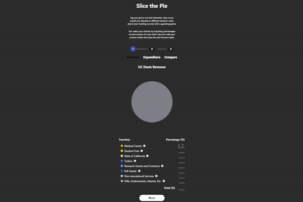
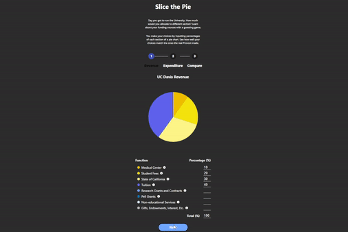

# Davis Budget Comparison 

## Description
This is a final project for a website programming class for UC Davis. The website uses D3, React, and JS, Vlite. 

The website compares what the user believes the allocated budget is for UC Davis against the real annual budget. 
It compares for both budgets of revenue and expenses for UC Davis. 

The project itself is called "Slice the Pie" in which the user inputs what the slices of budget they believed are allocated for both revenue and expenses. 

When the user inputs data, the pie chart will update to fit the appropriate data. 





## Dependencies 
- npm, react, D3, React, Vlite  

## Run the project 

To run this project, download this project and have npm or node installed. 
Open a terminal and run ```npm run dev```

This should run a local webserver on a localhost for the website to be viewed. 
